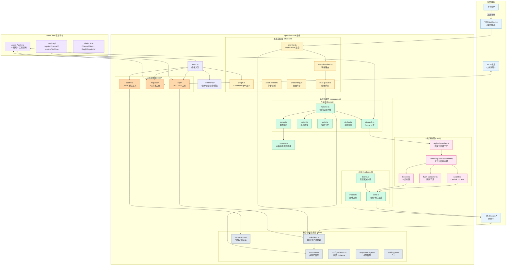
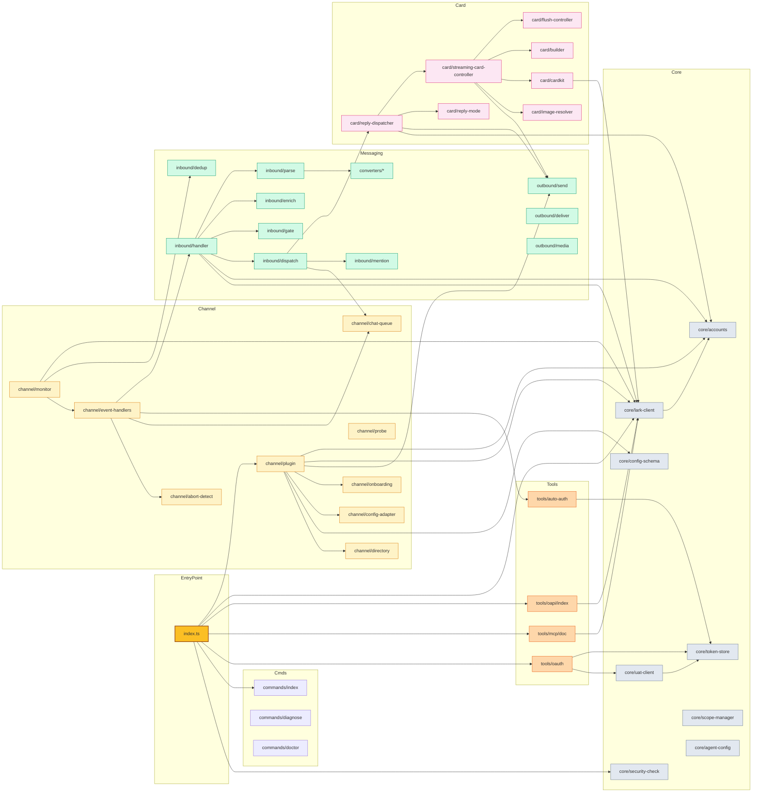
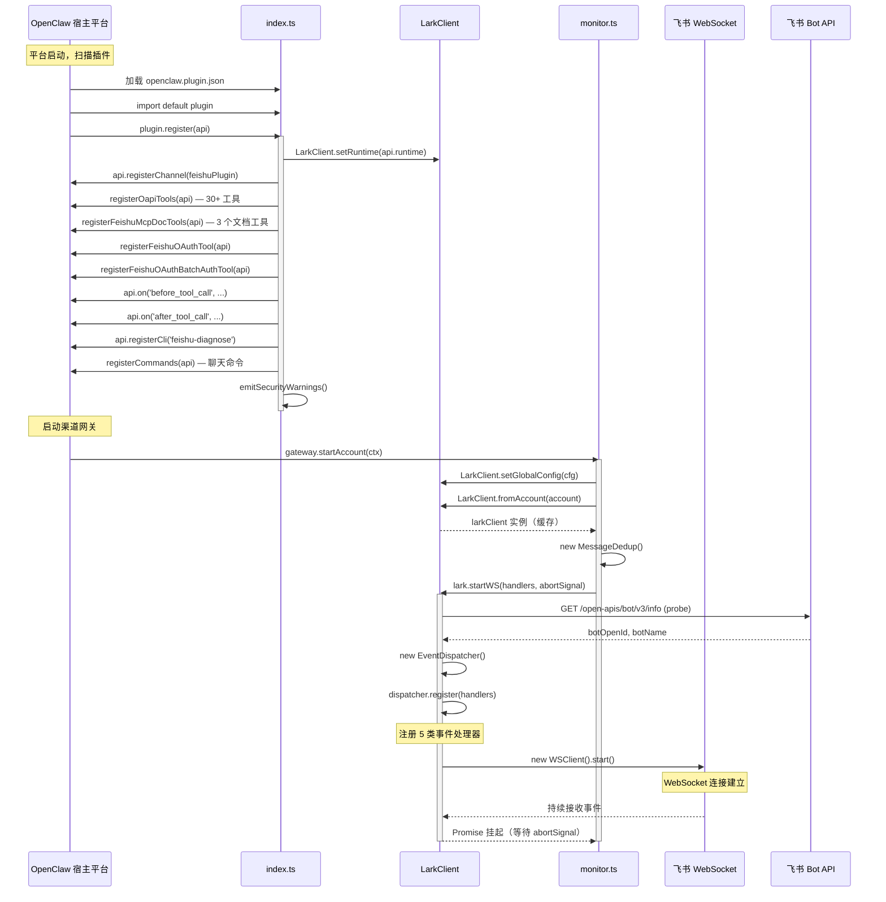
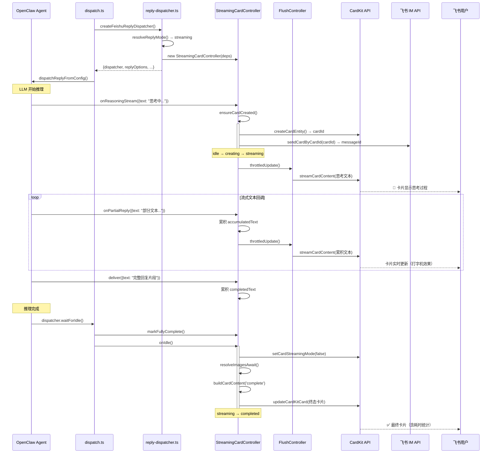
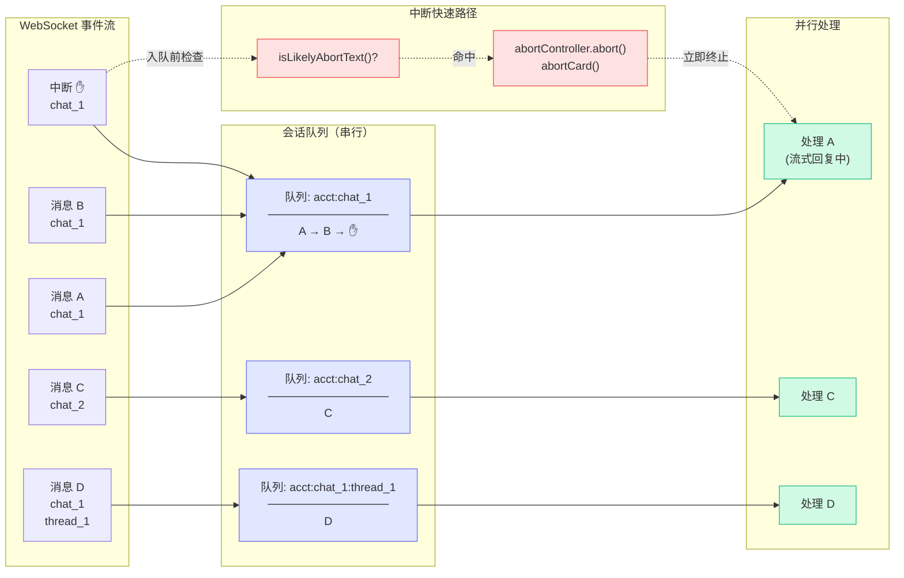
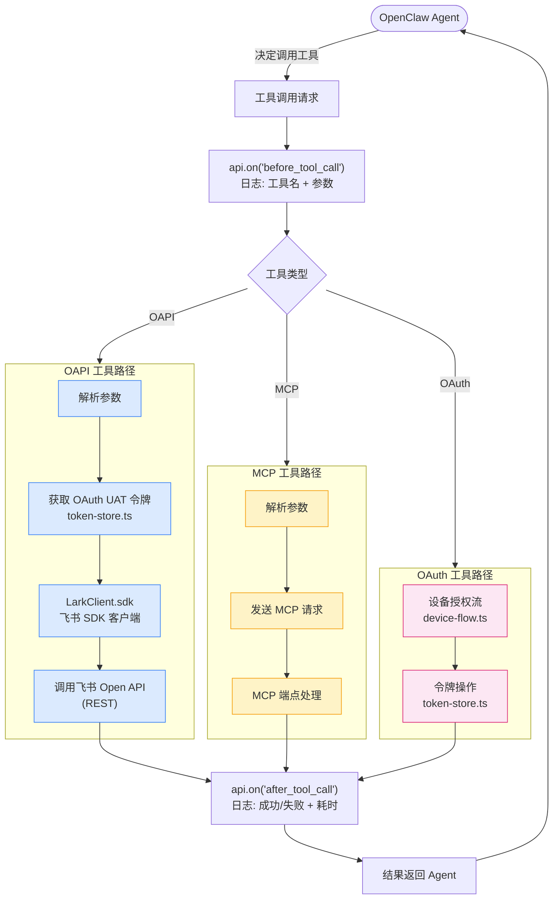
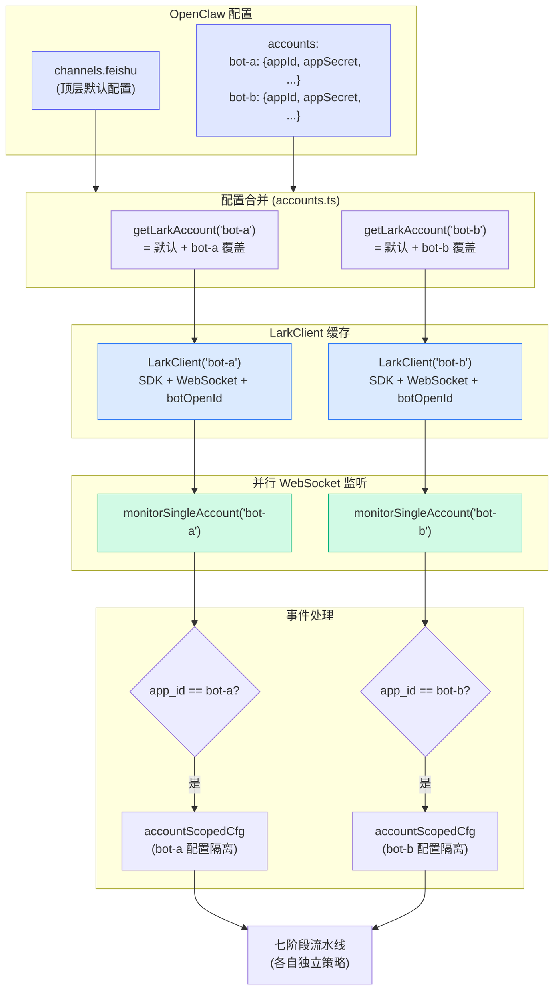
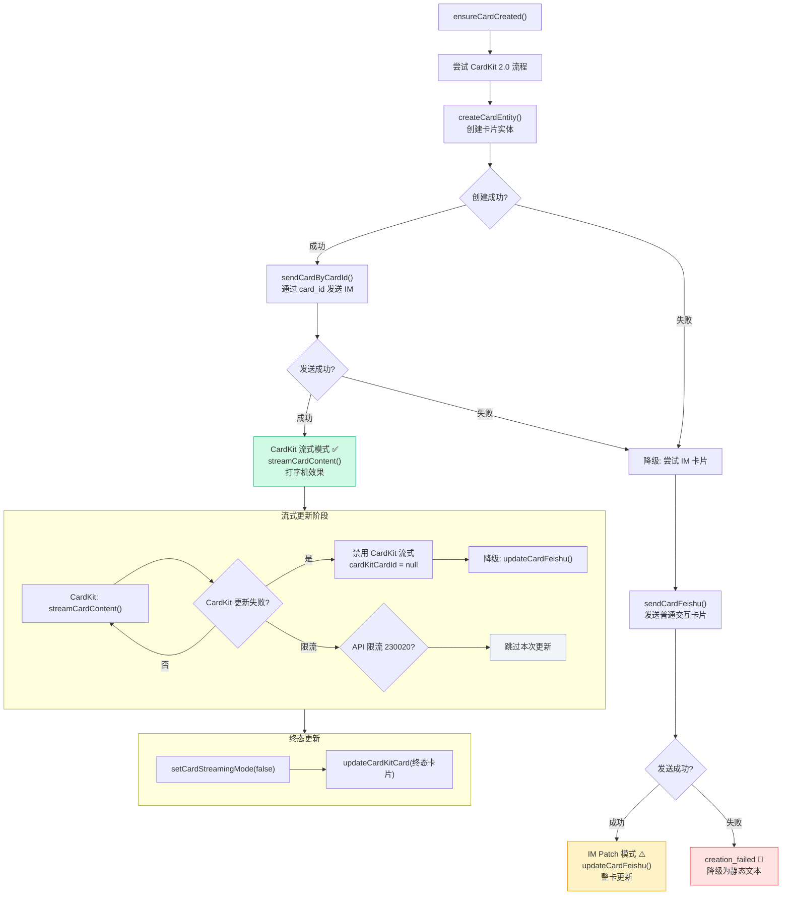

# OpenClaw Lark/Feishu Plugin — 架构图与流程图

> 本文档以 Mermaid 图表形式展示项目的整体架构、模块关系和核心业务流程。
> 配合 [overview.md](./overview.md) 和 [core.md](./core.md) 阅读效果更佳。

---

## 1. 整体分层架构



---

## 2. 模块依赖关系图



---

## 3. 插件启动流程



---

## 4. 入站消息处理流程（七阶段流水线）

```mermaid
flowchart TD
    Start([飞书用户发送消息]) --> WSEvent[WebSocket 事件到达]

    WSEvent --> EventHandler["event-handlers.ts<br/>handleMessageEvent()"]

    EventHandler --> OwnerCheck{事件所有权校验<br/>app_id 匹配?}
    OwnerCheck -->|不匹配| Discard1([丢弃])
    OwnerCheck -->|匹配| DedupCheck{消息去重<br/>tryRecord()}

    DedupCheck -->|重复| Discard2([跳过])
    DedupCheck -->|新消息| ExpiryCheck{过期检查<br/>isMessageExpired()}

    ExpiryCheck -->|过期| Discard3([丢弃])
    ExpiryCheck -->|有效| AbortCheck{中断快速路径<br/>isLikelyAbortText()?}

    AbortCheck -->|是中断指令| AbortFast["立即中断活跃回复<br/>abortController.abort()<br/>abortCard()"]
    AbortCheck -->|否| Enqueue

    AbortFast --> Enqueue["enqueueFeishuChatTask()<br/>加入会话串行队列"]
    Enqueue --> Pipeline

    subgraph Pipeline["handler.ts — 七阶段流水线"]
        direction TB
        S1["① 账号解析<br/>getLarkAccount()<br/>构造 accountScopedCfg"]
        S2["② 事件解析<br/>parseMessageEvent()<br/>→ MessageContext"]
        S3["③ 轻量增强<br/>resolveSenderInfo()<br/>解析发送者名称"]
        S4{"④ 策略门控<br/>checkMessageGate()"}
        S5["⑤ 用户名预热<br/>prefetchUserNames()"]
        S6["⑥ 重量级解析（并行）"]
        S7["⑦ 分发到 Agent<br/>dispatchToAgent()"]

        S1 --> S2 --> S3 --> S4
        S4 -->|拒绝| GateReject([记录历史 → 返回])
        S4 -->|通过| S5 --> S6 --> S7
    end

    subgraph ParallelResolve["阶段⑥ 并行执行"]
        ResolveMedia["resolveMedia()<br/>下载图片/文件"]
        ResolveQuote["resolveQuotedContent()<br/>解析引用消息"]
        SubstitutePaths["substituteMediaPaths()<br/>替换 file-key"]
    end

    S6 --> ParallelResolve

    subgraph DispatchRouting["阶段⑦ 分发路由"]
        IsFeishuCmd{/feishu_* 命令?}
        IsSysCmd{系统命令?<br/>/new /reset 等}
        IsAbortMsg{中断消息?}

        I18nCard["i18n 卡片回复"]
        SysDispatch["dispatchSystemCommand()<br/>纯文本回复"]
        NormalDispatch["dispatchNormalMessage()<br/>流式卡片回复"]

        IsFeishuCmd -->|是| I18nCard
        IsFeishuCmd -->|否| IsSysCmd
        IsSysCmd -->|是| SysDispatch
        IsSysCmd -->|否| IsAbortMsg
        IsAbortMsg -->|是| SysDispatch
        IsAbortMsg -->|否| NormalDispatch
    end

    S7 --> DispatchRouting

    classDef stage fill:#dbeafe,stroke:#3b82f6
    classDef reject fill:#fee2e2,stroke:#ef4444
    classDef success fill:#d1fae5,stroke:#10b981
    classDef parallel fill:#fef3c7,stroke:#f59e0b

    class S1,S2,S3,S5,S7 stage
    class Discard1,Discard2,Discard3,GateReject reject
    class NormalDispatch,SysDispatch,I18nCard success
    class ResolveMedia,ResolveQuote,SubstitutePaths parallel
```

---

## 5. 出站回复流程（流式卡片模式）



---

## 6. 流式卡片状态机

```mermaid
stateDiagram-v2
    [*] --> idle

    idle --> creating: ensureCardCreated()

    creating --> streaming: CardKit/IM 卡片创建成功
    creating --> creation_failed: 卡片创建失败
    creating --> aborted: 用户中断
    creating --> terminated: 消息不可用

    streaming --> completed: onIdle() 正常完成
    streaming --> aborted: abortCard() 用户中断
    streaming --> terminated: UnavailableGuard 检测

    creation_failed --> [*]: 降级为静态文本发送

    completed --> [*]
    aborted --> [*]
    terminated --> [*]

    note right of idle: 初始状态
    note right of creating: 正在创建 CardKit 实体\n和 IM 消息
    note right of streaming: 流式推送文本\nCardKit 打字机效果
    note right of completed: 终态卡片已更新
    note right of aborted: 显示已中断卡片
    note right of terminated: 消息被撤回/删除
    note right of creation_failed: 降级路径:\n走静态 deliver 发送
```

---

## 7. 消息队列与并发控制



---

## 8. 工具调用流程



---

## 9. 多账号架构



---

## 10. CardKit 降级策略



---

## 图表说明

| 图表 | 内容 |
|------|------|
| 图 1 | 整体分层架构：外部系统、宿主平台、插件各层及其交互 |
| 图 2 | 模块依赖关系：各源文件之间的 import 依赖拓扑 |
| 图 3 | 启动时序：从宿主平台加载插件到 WebSocket 连接建立 |
| 图 4 | 入站消息流程：事件验证 → 去重 → 七阶段流水线 → 分发路由 |
| 图 5 | 出站回复时序：Agent 推理 → 流式卡片创建 → 文本推送 → 终态更新 |
| 图 6 | 流式卡片状态机：6 种状态及其转换条件 |
| 图 7 | 消息队列：per-chat 串行 + 跨 chat 并行 + 中断快速路径 |
| 图 8 | 工具调用流程：OAPI / MCP / OAuth 三条路径 |
| 图 9 | 多账号架构：配置合并 → 客户端缓存 → 并行监听 → 配置隔离 |
| 图 10 | CardKit 降级策略：CardKit → IM Patch → 静态文本的三级降级 |
