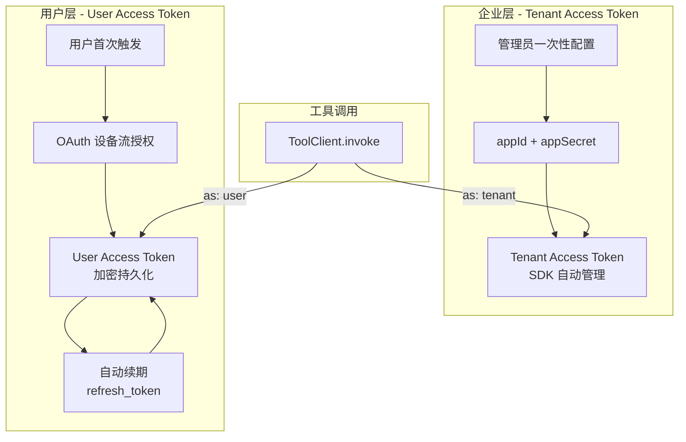
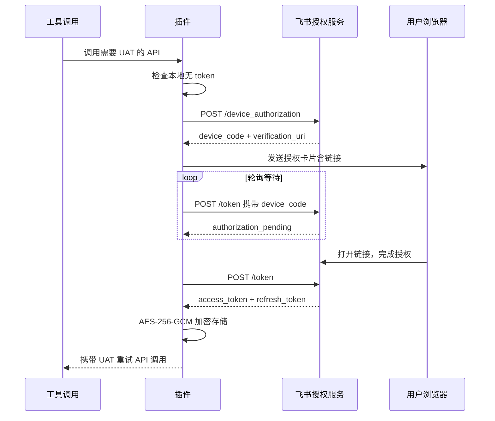
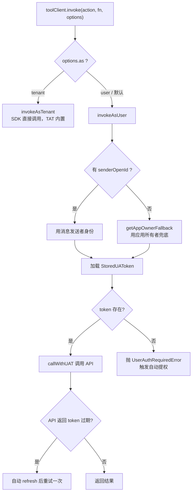
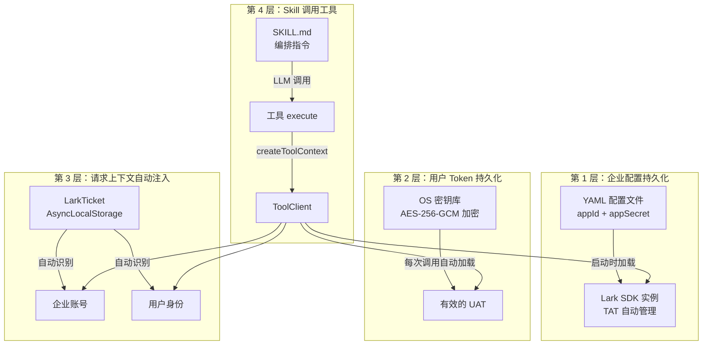
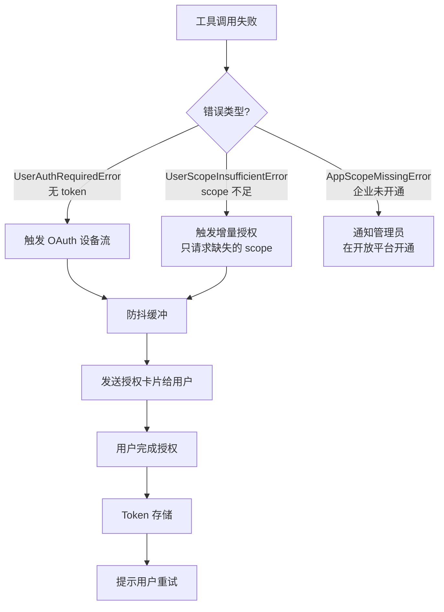
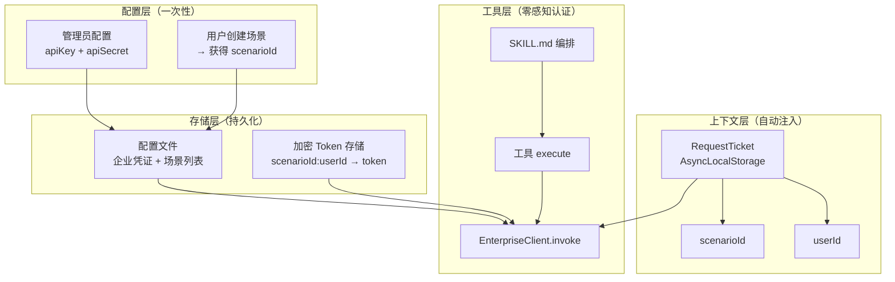

# 飞书插件企业级与个人级认证鉴权设计分析

> 深入分析 openclaw-lark 如何分离企业级（Tenant）与个人级（User）认证，
> 以及 Skill 如何实现"一次配置，持续使用"。
> 最后给出面向"企业场景 ID + 企业级接口"的借鉴方案。

---

## 目录

1. [双层认证模型概览](#1-双层认证模型概览)
2. [企业级认证：Tenant Access Token](#2-企业级认证tenant-access-token)
3. [个人级认证：User Access Token](#3-个人级认证user-access-token)
4. [ToolClient：双层认证的统一调度](#4-toolclient双层认证的统一调度)
5. [Token 持久化与自动续期](#5-token-持久化与自动续期)
6. [多账号隔离与上下文传播](#6-多账号隔离与上下文传播)
7. [Skill 一次配置持续使用的实现](#7-skill-一次配置持续使用的实现)
8. [自动提权：无感知的权限补全](#8-自动提权无感知的权限补全)
9. [借鉴方案：企业场景 ID + 企业级接口](#9-借鉴方案企业场景-id--企业级接口)

---

## 1. 双层认证模型概览

飞书插件的认证体系分为**企业层**和**用户层**两个独立维度：



| 维度 | 企业级 TAT | 个人级 UAT |
|------|-----------|-----------|
| 代表身份 | 应用自身 - 企业机器人 | 具体操作用户 |
| 获取方式 | appId + appSecret 自动换取 | OAuth 设备流，用户手动授权 |
| 生命周期 | SDK 内部管理，自动刷新 | 插件管理，proactive refresh |
| 存储位置 | SDK 内存缓存 | OS 密钥库加密持久化 |
| 配置频率 | 一次配置，永久使用 | 首次使用时授权，之后自动续期 |
| 典型场景 | 读取群列表、发送消息 | 创建用户日程、读取用户文档 |

---

## 2. 企业级认证：Tenant Access Token

### 2.1 配置方式

管理员在配置文件中一次性填入企业应用凭证：

```yaml
channels:
  feishu:
    appId: "cli_xxxxxxxxxxxx"       # 企业自建应用 ID
    appSecret: "xxxxxxxxxxxxxxxx"   # 企业自建应用 Secret
    encryptKey: "xxx"               # 事件加密密钥
    verificationToken: "xxx"        # 事件签名验证
```

### 2.2 TAT 的获取与管理

TAT 完全由 Lark SDK 内部管理，插件代码**零感知**：

```
LarkClient.fromAccount(account)
  └── new Lark.Client({ appId, appSecret, domain })
        └── SDK 内部自动：
              ├── POST /open-apis/auth/v3/tenant_access_token/internal
              ├── 缓存 token（默认 2 小时有效）
              └── 过期前自动续期
```

**源码位置** `src/core/lark-client.ts`：SDK 实例按 account 缓存，整个应用生命周期只创建一次。

### 2.3 多账号支持

```yaml
channels:
  feishu:
    appId: "cli_default"          # 默认账号
    appSecret: "secret_default"
    accounts:
      prod:                       # 生产环境账号
        appId: "cli_prod"
        appSecret: "secret_prod"
      staging:                    # 测试环境账号
        appId: "cli_staging"
        appSecret: "secret_staging"
```

**源码位置** `src/core/accounts.ts`：

```typescript
// 获取所有启用的账号
export function getEnabledLarkAccounts(cfg): LarkAccount[]

// 解析单个账号（account 级配置覆盖顶层默认值）
export function getLarkAccount(cfg, accountId?): LarkAccount
```

核心设计：**account 级字段覆盖顶层默认值**，未设置的字段继承顶层配置。

---

## 3. 个人级认证：User Access Token

### 3.1 OAuth 设备流（RFC 8628）

飞书采用 **OAuth 2.0 Device Authorization Grant**，专为 CLI / 机器人等"无浏览器"场景设计：



### 3.2 Token 结构

**源码位置** `src/core/token-store.ts`：

```typescript
interface StoredUAToken {
  userOpenId: string;         // 用户唯一标识
  appId: string;              // 所属企业应用
  accessToken: string;        // 短期 token（约 2 小时）
  refreshToken: string;       // 长期 token（7-365 天）
  expiresAt: number;          // access_token 过期时间
  refreshExpiresAt: number;   // refresh_token 过期时间
  scope: string;              // 已授权的权限列表
  grantedAt: number;          // 首次授权时间
}
```

存储键：`appId:userOpenId` — 同一用户在不同企业应用下有独立的 token。

### 3.3 用户只需授权一次的关键

1. **Token 加密持久化**：token 存入 OS 密钥库（macOS Keychain）或 AES-256-GCM 加密文件
2. **自动续期**：access_token 过期前 5 分钟主动刷新，用户无感知
3. **refresh_token 长有效期**：可达 365 天，覆盖绝大多数使用场景
4. **增量授权**：新增 scope 时只需补充授权，不需要重新走完整流程

---

## 4. ToolClient：双层认证的统一调度

### 4.1 invoke 内部流程

**源码位置** `src/core/tool-client.ts`：

```typescript
async invoke<T>(toolAction, fn, options?) {
  // 1. 查询 API 所需的 scopes
  const requiredScopes = getRequiredScopes(toolAction);

  // 2. 决定 token 类型（默认走用户身份）
  const tokenType = options?.as ?? 'user';

  // 3. 检查企业应用已开通的 scope（含 offline_access）
  const appGrantedScopes = await getAppGrantedScopes(sdk, appId, tokenType);
  const missing = missingScopes(appGrantedScopes, requiredScopes);
  if (missing.length > 0) throw new AppScopeMissingError(...);

  // 4. 分流执行
  if (tokenType === 'tenant') {
    return this.invokeAsTenant(toolAction, fn);   // 直接用 SDK
  }

  // 5. 用户身份：解析 userOpenId → 加载 token → 校验 scope → 调用
  let userOpenId = options?.userOpenId ?? this.senderOpenId;
  if (!userOpenId) {
    userOpenId = await getAppOwnerFallback(account, sdk); // 兜底：应用所有者
  }
  return this.invokeAsUser(toolAction, fn, requiredScopes, userOpenId);
}
```

### 4.2 TAT 与 UAT 的路由决策



### 4.3 三级 Scope 校验

```
Required Scopes（API 定义需要什么权限）
       ↓ 对比
App Granted Scopes（企业应用开通了什么权限）
       ↓ 对比
User Granted Scopes（用户授权了什么权限）
       ↓
通过 → 调用 API
```

| 校验层 | 缺失时的错误 | 解决者 |
|--------|-------------|--------|
| App Scope | `AppScopeMissingError` | 企业管理员在飞书开放平台开通 |
| User Scope | `UserAuthRequiredError` | 用户通过 OAuth 授权 |
| 服务端 | `UserScopeInsufficientError` | 用户补充授权 |

---

## 5. Token 持久化与自动续期

### 5.1 存储后端

| 平台 | 存储方式 | 位置 |
|------|---------|------|
| macOS | Keychain Access（原生） | `security` CLI |
| Linux | AES-256-GCM 加密文件 | `~/.local/share/openclaw-feishu-uat/` |
| Windows | AES-256-GCM 加密文件 | `%LOCALAPPDATA%\openclaw-feishu-uat\` |

加密文件格式：`[IV 12字节][AuthTag 16字节][密文]`，主密钥文件权限 `0600`。

### 5.2 自动续期机制

**源码位置** `src/core/uat-client.ts`：

```typescript
// Token 状态判定
function tokenStatus(token): 'valid' | 'needs_refresh' | 'expired' {
  if (token.expiresAt - Date.now() > 5 * 60 * 1000) return 'valid';
  if (Date.now() < token.refreshExpiresAt) return 'needs_refresh';
  return 'expired';
}

// 调用时自动续期
async function callWithUAT(opts, apiCall) {
  const accessToken = await getValidAccessToken(opts);
  try {
    return await apiCall(accessToken);
  } catch (err) {
    if (isTokenExpiredError(err)) {
      // 刷新 token 后重试一次
      const refreshed = await refreshWithLock(opts, stored);
      return await apiCall(refreshed.accessToken);
    }
    throw err;
  }
}
```

### 5.3 并发安全

```typescript
// refresh_token 是一次性的，多个并发请求必须排队
const refreshLocks = new Map<string, Promise<StoredUAToken>>();

async function refreshWithLock(opts, stored) {
  const key = `${opts.appId}:${opts.userOpenId}`;
  const existing = refreshLocks.get(key);
  if (existing) {
    await existing;                              // 等待已有刷新完成
    return getStoredToken(opts.appId, opts.userOpenId); // 读取新 token
  }
  // 本次执行刷新，其他请求等待
  const promise = doRefreshToken(opts, stored);
  refreshLocks.set(key, promise);
  try { return await promise; }
  finally { refreshLocks.delete(key); }
}
```

---

## 6. 多账号隔离与上下文传播

### 6.1 LarkTicket：请求级上下文

**源码位置** `src/core/lark-ticket.ts`：

```typescript
interface LarkTicket {
  messageId: string;
  chatId: string;
  accountId: string;      // ← 当前企业账号
  senderOpenId?: string;  // ← 当前操作用户
  startTime: number;
  chatType?: 'p2p' | 'group';
}

// 基于 Node.js AsyncLocalStorage，无需参数透传
const store = new AsyncLocalStorage<LarkTicket>();

// 事件入口处注入
export function withTicket<T>(ticket, fn): T | Promise<T> {
  return store.run(ticket, fn);
}

// 任意下游代码中获取
export function getTicket(): LarkTicket | undefined {
  return store.getStore();
}
```

### 6.2 上下文传播链

```
飞书消息事件到达
  ↓
event-handlers.ts: 从事件中提取 accountId + senderOpenId
  ↓
withTicket({ accountId, senderOpenId, ... }, handler)
  ↓ AsyncLocalStorage 自动传播
tool.execute() → createToolContext()
  ↓ getTicket()
createClientGetter: 用 ticket.accountId 解析企业账号 → SDK 实例
  ↓
ToolClient: 用 ticket.senderOpenId 加载用户 token
  ↓
callWithUAT: 用正确的 appId + userOpenId 调用 API
```

**关键设计**：工具代码完全不需要关心"当前是哪个企业、哪个用户"，
`LarkTicket` 通过 AsyncLocalStorage 在整个异步调用链中自动传播。

---

## 7. Skill 一次配置持续使用的实现

### 7.1 Skill 的本质

Skill 是**纯 Markdown 文件**（SKILL.md），只定义"如何编排工具"的指令，不包含认证逻辑：

```markdown
---
name: feishu-calendar
description: 管理飞书日历事件
---
## 使用说明
当用户需要操作日历时，调用 feishu_calendar_event 工具...
```

Skill **不持有任何凭证或状态**——认证完全由底层 ToolClient 处理。

### 7.2 "一次配置，持续使用"的四层机制



**为什么 Skill 不需要重复配置**：

| 层 | 做什么 | 配置频率 |
|----|--------|---------|
| 企业配置 | appId/appSecret → SDK 实例 | 管理员配一次 |
| 用户 Token | OAuth 授权 → 加密存储 → 自动续期 | 用户授权一次，之后自动续期 |
| 请求上下文 | 从消息事件提取 accountId + senderOpenId | 每次请求自动注入 |
| Skill | Markdown 指令，告诉 LLM 调用哪些工具 | 写一次，永久生效 |

### 7.3 具体工具的调用链（以日历为例）

```
用户: "帮我创建明天下午3点的会议"
  ↓
LLM 匹配 Skill: feishu-calendar
  ↓
LLM 调用工具: feishu_calendar_event { action: "create", ... }
  ↓
tool.execute(input, context)
  ↓
createToolContext(api, "calendar_event")
  ├── getTicket() → { accountId: "default", senderOpenId: "ou_xxx" }
  ├── getLarkAccount(config, "default") → { appId, appSecret, ... }
  └── new ToolClient({ account, senderOpenId, sdk })
  ↓
toolClient.invoke("calendar.v4.calendarEvent.create", fn, { as: "user" })
  ├── getRequiredScopes → ["calendar:calendar"]
  ├── getAppGrantedScopes → 检查企业已开通
  ├── getStoredToken("cli_xxx", "ou_xxx") → 从密钥库加载
  ├── tokenStatus → "valid" / "needs_refresh"
  └── callWithUAT → 携带 UAT 调用飞书 API
  ↓
返回日历事件创建结果
```

整个过程中，**Skill 和 Tool 代码没有任何认证相关的代码**。

---

## 8. 自动提权：无感知的权限补全

### 8.1 错误驱动的授权流程

当工具调用因缺少权限而失败时，`auto-auth.ts` 自动触发 OAuth 授权：



### 8.2 防抖缓冲

多个工具同时失败时，避免向用户发送多条授权请求：

```
50ms  快速窗口 — 合并同一 tick 的多个失败
150ms 中速窗口 — 合并连续失败
500ms 慢速窗口 — 最终合并
30s   冷却期   — 避免频繁打扰用户
```

### 8.3 渐进式授权

飞书插件**不要求用户预先授予所有权限**：

1. 用户第一次用日历工具 → 只授权 `calendar:calendar` scope
2. 用户第一次用文档工具 → 只补充授权 `docx:document` scope
3. 已有的授权不受影响

这保证了**最小权限原则**：用户只授予实际需要的权限。

---

## 9. 借鉴方案：企业场景 ID + 企业级接口

基于飞书插件的设计，以下是适配"用户创建企业场景 → 传入场景 ID 调用企业接口"的方案。

### 9.1 概念映射

| 飞书概念 | 你的系统对应 |
|---------|-------------|
| appId + appSecret | 企业级 API Key / Secret |
| accountId（多账号） | **场景 ID**（scenarioId） |
| Tenant Access Token | 企业级接口的 token |
| User Access Token | 用户个人的操作凭证 |
| LarkTicket.accountId | 当前请求的场景 ID |
| LarkTicket.senderOpenId | 当前操作的用户 ID |

### 9.2 推荐架构



### 9.3 核心实现建议

#### 1. 场景配置持久化

```yaml
# 对标飞书的 channels.feishu.accounts
enterprise:
  apiKey: "ent_xxxxxxxxxxxx"
  apiSecret: "xxxxxxxxxxxxxxxx"
  scenarios:
    scenario_abc:              # 场景 ID（对标 accountId）
      name: "客户管理场景"
      scenarioId: "scn_abc123"
      # 场景级配置覆盖顶层默认值
    scenario_xyz:
      name: "订单处理场景"
      scenarioId: "scn_xyz789"
```

#### 2. 请求上下文传播（对标 LarkTicket）

```typescript
interface RequestTicket {
  requestId: string;
  scenarioId: string;      // 对标 accountId
  userId: string;           // 对标 senderOpenId
  startTime: number;
}

const store = new AsyncLocalStorage<RequestTicket>();

// 入口处注入
function withRequestTicket<T>(ticket: RequestTicket, fn: () => T): T {
  return store.run(ticket, fn);
}

// 任意下游获取
function getRequestTicket(): RequestTicket | undefined {
  return store.getStore();
}
```

#### 3. 统一客户端（对标 ToolClient）

```typescript
class EnterpriseClient {
  async invoke<T>(action: string, fn: ApiFn<T>, options?: InvokeOptions): Promise<T> {
    // 1. 从 RequestTicket 获取 scenarioId + userId
    const ticket = getRequestTicket();
    const scenarioId = options?.scenarioId ?? ticket?.scenarioId;
    const userId = options?.userId ?? ticket?.userId;

    // 2. 解析场景配置
    const scenario = getScenario(this.config, scenarioId);

    // 3. 获取企业级 token（对标 TAT）
    const enterpriseToken = await getEnterpriseToken(scenario);

    // 4. 如果需要用户级操作
    if (options?.as === 'user') {
      const userToken = await getStoredUserToken(scenarioId, userId);
      if (!userToken) {
        throw new UserAuthRequiredError(userId, scenarioId);
      }
      return callWithAutoRefresh(userToken, fn);
    }

    // 5. 企业级调用，传入 scenarioId
    return fn(enterpriseToken, { scenarioId });
  }
}
```

#### 4. 场景创建命令（对标 /feishu auth）

```typescript
api.registerCommand({
  name: 'enterprise',
  handler: async (args, ctx) => {
    switch (args[0]) {
      case 'create-scenario':
        // 调用企业接口创建场景
        const result = await enterpriseApi.createScenario({
          name: args[1],
          apiKey: config.apiKey,
        });
        // 保存 scenarioId 到配置
        await saveScenarioConfig(result.scenarioId, { name: args[1] });
        return `场景已创建: ${result.scenarioId}`;

      case 'auth':
        // 用户授权流程（对标 OAuth 设备流）
        return triggerUserAuth(ctx.userId);
    }
  },
});
```

#### 5. Skill 定义（与飞书完全一致）

```markdown
---
name: enterprise-order
description: 管理企业订单
---
## 使用说明
当用户需要管理订单时，先确认当前场景 ID，然后调用以下工具：
- `enterprise_order_create`: 创建订单
- `enterprise_order_query`: 查询订单
```

Skill 不包含任何场景 ID 或认证信息 —— 全部由底层自动注入。

### 9.4 "一次配置，持续使用"的保证

```
用户首次使用:
  1. 管理员配置 apiKey + apiSecret  ←── 一次性
  2. 用户执行 /enterprise create-scenario  ←── 一次性，获得 scenarioId
  3. 用户执行 /enterprise auth  ←── 一次性，获得个人 token

后续每次使用:
  消息到达 → RequestTicket 自动注入 scenarioId + userId
    → 工具调用 → EnterpriseClient 自动加载配置和 token
    → 企业接口调用携带 scenarioId
    → token 过期？自动 refresh
    → scope 不足？自动触发补充授权
```

### 9.5 飞书设计的核心可借鉴点

| 设计原则 | 飞书实现 | 你的系统应用 |
|---------|---------|-------------|
| **凭证与代码分离** | 配置文件存凭证，代码不感知 | 场景 ID 和凭证存配置，工具/Skill 零感知 |
| **上下文自动传播** | AsyncLocalStorage + LarkTicket | RequestTicket 传播 scenarioId + userId |
| **Token 加密持久化** | OS 密钥库 / AES-256-GCM | 同样方案，key = scenarioId:userId |
| **自动续期** | proactive refresh + retry | 照搬 callWithUAT 的 refresh + retry 模式 |
| **渐进式授权** | 按需触发 OAuth，只请求缺失 scope | 场景按需创建，权限按需申请 |
| **多账号隔离** | accountId 维度隔离 SDK 和 token | scenarioId 维度隔离场景配置和 token |
| **统一调用层** | ToolClient.invoke 一个入口 | EnterpriseClient.invoke 一个入口 |
| **Skill 纯编排** | SKILL.md 只定义工具使用方式 | 同样模式，Skill 不含认证逻辑 |
