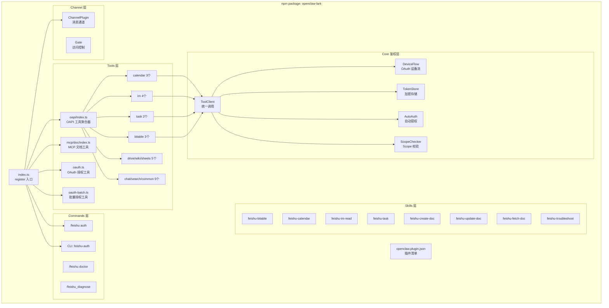
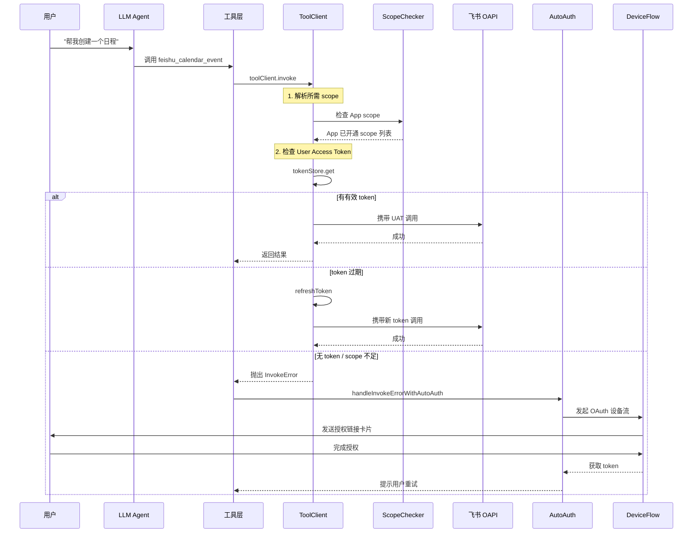
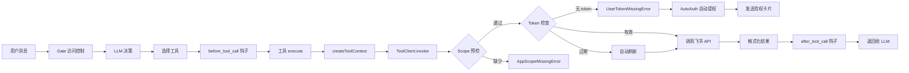

# 飞书插件设计分析：一个安装包搞定 Tools + Skills + 鉴权 + 提权

> 本文分析 `openclaw-lark` 飞书插件如何在一个 npm 包中集成 30+ 工具、8 个技能、
> 聊天命令、CLI 命令、OAuth 鉴权、自动提权等能力，并保持各模块松耦合。

---

## 目录

1. [总体架构](#1-总体架构)
2. [插件清单与入口](#2-插件清单与入口)
3. [工具注册：聚合器模式](#3-工具注册聚合器模式)
4. [技能系统：Markdown 即定义](#4-技能系统markdown-即定义)
5. [命令注册：聊天命令 + CLI](#5-命令注册聊天命令--cli)
6. [鉴权集成：Tool → ToolClient → 自动提权](#6-鉴权集成tool--toolclient--自动提权)
7. [Channel 插件：消息通道抽象](#7-channel-插件消息通道抽象)
8. [安全防线：多层校验](#8-安全防线多层校验)
9. [工具调用链全景](#9-工具调用链全景)
10. [设计亮点总结](#10-设计亮点总结)

---

## 1. 总体架构



---

## 2. 插件清单与入口

### 2.1 清单文件 `openclaw.plugin.json`

```json
{
  "id": "openclaw-lark",
  "channels": ["feishu"],
  "skills": ["./skills"],
  "configSchema": { ... }
}
```

三个关键字段：
- **`channels`**: 声明本插件提供 `feishu` 消息通道
- **`skills`**: 指向 `./skills` 目录，运行时自动扫描其中所有 `SKILL.md`
- **`configSchema`**: 提供配置校验 schema（实际由代码中 `emptyPluginConfigSchema()` 生成）

### 2.2 入口 `index.ts` — 一个 `register()` 搞定一切

```typescript
const plugin = {
  id: 'openclaw-lark',
  name: 'Feishu',
  configSchema: emptyPluginConfigSchema(),
  register(api: OpenClawPluginApi) {
    // 1. 注入运行时
    LarkClient.setRuntime(api.runtime);

    // 2. 注册消息通道
    api.registerChannel({ plugin: feishuPlugin });

    // 3. 注册所有 OAPI 工具（30+）
    registerOapiTools(api);

    // 4. 注册 MCP 文档工具
    registerFeishuMcpDocTools(api);

    // 5. 注册 OAuth 工具
    registerFeishuOAuthTool(api);
    registerFeishuOAuthBatchAuthTool(api);

    // 6. 注册工具调用钩子（鉴权集成）
    api.on('before_tool_call', toolCallHookBefore);
    api.on('after_tool_call', toolCallHookAfter);

    // 7. 注册 CLI 命令
    api.registerCli(...);

    // 8. 注册聊天命令
    registerCommands(api);

    // 9. 安全警告
    emitSecurityWarnings(api.config, api.logger);
  },
};
```

**核心设计思想**：`register()` 是唯一的集成入口，所有能力通过 `api` 对象注册到宿主框架。
插件不需要关心宿主如何调度，只需在 `register()` 中把能力"声明"出去。

---

## 3. 工具注册：聚合器模式

### 3.1 两级聚合

```
index.ts
  └── registerOapiTools(api)          ← 一级聚合
        ├── registerCommonTools(api)   ← 二级：通用工具
        ├── registerChatTools(api)     ← 二级：群聊工具
        ├── registerImTools(api)       ← 二级：消息工具
        ├── registerCalendarTools(api) ← 二级：日历工具
        ├── registerTaskTools(api)     ← 二级：任务工具
        ├── registerBitableTools(api)  ← 二级：多维表格工具
        ├── registerSearchTools(api)   ← 二级：搜索工具
        ├── registerDriveTools(api)    ← 二级：云文档工具
        ├── registerWikiTools(api)     ← 二级：知识库工具
        └── registerSheetsTools(api)   ← 二级：电子表格工具
```

每个二级聚合器内部注册 1-4 个具体工具。这种模式让新增一个工具只需要：
1. 在对应领域目录下写一个工具文件
2. 在二级聚合器中添加一行 `registerXxxTool(api)`

### 3.2 工具注册辅助函数

`src/tools/helpers.ts` 提供了统一的注册入口：

```typescript
export function registerTool(
  api: OpenClawPluginApi,
  tool: ToolDefinition,
  opts?: { toolName?: string },
) {
  const name = opts?.toolName ?? tool.name;

  // Deny-list 检查：管理员可通过配置禁用特定工具
  if (!checkToolRegistration(api, name)) return;

  api.registerTool(tool);
}
```

关键点：
- **Deny-list 机制**：通过 `channels.feishu.tools.deny` 配置项，管理员可按名称禁用任意工具
- **统一包装**：所有工具都经过同一个入口注册，便于添加全局逻辑

### 3.3 工具上下文工厂

每个工具调用时需要 SDK 客户端、日志器等。`createToolContext()` 统一提供：

```typescript
export function createToolContext(api: OpenClawPluginApi, toolName: string) {
  return {
    getClient: createClientGetter(api.config),  // 解析账号 → SDK 实例
    toolClient: new ToolClient(...),             // 统一 API 调用层
    log: api.logger.child(toolName),             // 带工具名的日志器
  };
}
```

### 3.4 具体工具示例（日历事件）

```typescript
// tools/oapi/calendar/event.ts
const schema = Type.Union([
  Type.Object({ action: Type.Literal('create'), ... }),
  Type.Object({ action: Type.Literal('update'), ... }),
  Type.Object({ action: Type.Literal('delete'), ... }),
  Type.Object({ action: Type.Literal('list'), ... }),
]);

const tool: ToolDefinition = {
  name: 'feishu_calendar_event',
  description: '管理飞书日历事件',
  inputSchema: schema,
  async execute(input, context) {
    const { toolClient } = createToolContext(api, 'calendar_event');
    try {
      const result = await toolClient.invoke({ ... });
      return formatToolResult(result);
    } catch (err) {
      // 自动提权处理
      return handleInvokeErrorWithAutoAuth(err, context);
    }
  },
};
```

**要点**：
- TypeBox 定义输入 schema，支持多 action 的 Union 类型
- `toolClient.invoke()` 统一调用，内含 scope 校验 + token 自动刷新
- `handleInvokeErrorWithAutoAuth` 捕获 401/403 错误后触发自动提权流程

---

## 4. 技能系统：Markdown 即定义

### 4.1 技能发现机制

```
openclaw.plugin.json
  └── "skills": ["./skills"]
        └── 运行时扫描 skills/ 下所有 SKILL.md
```

无需代码注册——只要在 `skills/` 目录下放一个 `SKILL.md`，宿主框架就会自动发现并加载。

### 4.2 SKILL.md 结构

每个技能文件由 YAML frontmatter + Markdown 正文组成：

```markdown
---
name: feishu-calendar
description: 管理飞书日历事件（创建、查询、更新、删除日程）
---

## 使用说明

当用户需要操作日历时，请使用以下工具...

## 工具调用指南

### 创建日程
调用 `feishu_calendar_event` 工具，设置 action 为 "create"...
```

- **frontmatter**：提供名称和描述，供 LLM 在技能选择时参考
- **正文**：详细的使用指南，注入到 LLM 的 system prompt 中

### 4.3 技能与工具的关系

技能 ≠ 工具。技能是**编排层**，告诉 LLM 如何组合使用多个工具：

| 技能 | 编排的工具 |
|------|-----------|
| feishu-calendar | `feishu_calendar_event` + `feishu_calendar_list` |
| feishu-bitable | `feishu_bitable_record` + `feishu_bitable_table` + `feishu_bitable_field` |
| feishu-im-read | `feishu_im_read` + `feishu_im_list` |
| feishu-create-doc | `feishu_doc_create` |
| feishu-update-doc | `feishu_doc_update` |
| feishu-fetch-doc | `feishu_doc_fetch` |
| feishu-task | `feishu_task` + `feishu_task_list` |
| feishu-troubleshoot | `feishu_diagnose`（诊断命令） |

**好处**：
- 技能定义无需写代码，产品经理也能编写
- 技能可以跨工具编排，提供更高层的任务指导
- 修改技能不需要重新发布 npm 包（如果宿主支持热加载）

---

## 5. 命令注册：聊天命令 + CLI

### 5.1 聊天命令

```typescript
// commands/index.ts
export function registerCommands(api: OpenClawPluginApi) {
  // 统一命令入口
  api.registerCommand({
    name: 'feishu',
    description: '飞书功能入口',
    acceptsArgs: true,
    handler: async (args, ctx) => {
      const subcommand = args[0];
      switch (subcommand) {
        case 'auth':   return handleAuth(ctx);
        case 'doctor': return handleDoctor(ctx);
        case 'start':  return handleStart(ctx);
        default:       return handleHelp(ctx);
      }
    },
  });

  // 兼容旧命令
  api.registerCommand({ name: 'feishu_diagnose', ... });
  api.registerCommand({ name: 'feishu_doctor', ... });
  api.registerCommand({ name: 'feishu_auth', ... });
}
```

用户在聊天中输入 `/feishu auth` 即可触发 OAuth 授权流程。

### 5.2 CLI 命令

```typescript
api.registerCli({
  name: 'feishu-auth',
  description: '通过命令行完成飞书 OAuth 授权',
  handler: async (args) => { ... },
});
```

CLI 命令让开发者可以在终端中直接操作，不依赖聊天界面。

---

## 6. 鉴权集成：Tool → ToolClient → 自动提权

这是本插件最精巧的设计——**鉴权完全透明地嵌入工具调用链**。

### 6.1 调用链全景



### 6.2 ToolClient：统一调用层

`ToolClient` 是所有 OAPI 调用的唯一出口，封装了完整的鉴权逻辑：

```
invoke(params)
  ├── 1. Scope 预检
  │     ├── 获取 App 已开通 scope（带 30s 缓存）
  │     ├── 计算交集：App scope ∩ API 所需 scope
  │     └── 缺少必须 scope → 抛 AppScopeMissingError
  │
  ├── 2. Token 选择
  │     ├── 需要 User Access Token？
  │     │     ├── tokenStore 查已有 token
  │     │     ├── 过期 → 自动 refresh
  │     │     └── 无 token → 抛 UserTokenMissingError
  │     └── 否则用 Tenant Access Token（SDK 自动管理）
  │
  ├── 3. API 调用
  │     └── sdk.request(method, url, params, token)
  │
  └── 4. 错误处理
        ├── 401 → token 无效，触发重新授权
        ├── 403 → scope 不足，提示用户
        └── 其他 → 结构化错误返回
```

### 6.3 自动提权（Auto-Auth）

当工具调用因缺少用户授权而失败时，`auto-auth.ts` 自动触发 OAuth 流程：

```
handleInvokeErrorWithAutoAuth(error)
  ├── 识别错误类型
  │     ├── UserTokenMissingError → 需要用户首次授权
  │     ├── ScopeInsufficientError → 需要追加 scope
  │     └── TokenExpiredError → 需要重新授权
  │
  ├── 防抖缓冲（避免同时触发多次授权）
  │     ├── 50ms 快速窗口：合并同一 tick 的多个请求
  │     ├── 150ms 中速窗口：合并连续失败的请求
  │     ├── 500ms 慢速窗口：最终合并
  │     └── 30s 冷却期：避免频繁打扰用户
  │
  └── 发起授权
        ├── 计算需要的 scope 集合
        ├── 通过 DeviceFlow 生成授权链接
        └── 以飞书卡片形式发送给用户
```

### 6.4 OAuth 设备流（RFC 8628）

专为"无浏览器"场景设计：

1. 插件向飞书请求 `device_code` + `verification_uri`
2. 将授权链接以卡片形式发给用户
3. 用户在浏览器中打开链接、完成授权
4. 插件轮询 token 端点，获取 `access_token` + `refresh_token`
5. Token 加密存储到本地（AES-256-GCM）

---

## 7. Channel 插件：消息通道抽象

`src/channel/plugin.ts` 实现 `ChannelPlugin<LarkAccount>` 接口：

```typescript
const feishuPlugin: ChannelPlugin<LarkAccount> = {
  meta: { id: 'feishu', name: '飞书', ... },

  // 能力声明
  capabilities: {
    chatTypes: ['dm', 'group'],
    media: ['image', 'file'],
    reactions: true,
    threads: false,
    nativeCommands: true,
    blockStreaming: false,
  },

  // Agent 提示词（注入到 LLM system prompt）
  agentPrompt: (account) => `你正在通过飞书与用户对话...`,

  // 消息分组策略
  groups: { ... },

  // 配对机制
  pairing: { ... },

  // 热重载
  reload: async () => { ... },
};
```

Channel 插件让宿主框架知道：
- 飞书支持哪些消息类型（DM、群聊）
- 支持哪些媒体格式
- 如何向 LLM 描述当前通道的上下文

---

## 8. 安全防线：多层校验

### 8.1 入站消息控制

```
收到飞书消息
  ├── 群消息 → 三层过滤
  │     ├── Layer 1: 群级别 — 允许哪些群
  │     ├── Layer 2: 发送者 — 允许哪些人
  │     └── Layer 3: @提及 — 是否需要 @bot
  │
  └── 私聊消息 → 四种策略
        ├── disabled: 禁止所有私聊
        ├── open: 允许所有人
        ├── allowlist: 白名单制
        └── pairing: 配对制（首次需确认）
```

### 8.2 工具调用安全

| 层级 | 机制 | 位置 |
|------|------|------|
| 工具注册时 | Deny-list 过滤 | `helpers.ts: checkToolRegistration` |
| 调用前 | `before_tool_call` 钩子 | `index.ts` |
| Scope 预检 | App scope ∩ API scope | `tool-client.ts` |
| Token 校验 | UAT 有效性 + 自动刷新 | `tool-client.ts` |
| Owner 限制 | 仅应用 Owner 可执行敏感操作 | `owner-policy.ts` |
| 调用后 | `after_tool_call` 钩子 | `index.ts` |

### 8.3 多账号隔离

- 每个 LarkAccount 独立的 SDK 实例、Token 存储、配置
- `LarkTicket` 机制确保工具调用时解析到正确的账号上下文
- 跨账号调用会被 `security-check.ts` 拦截

---

## 9. 工具调用链全景



---

## 10. 设计亮点总结

### 10.1 "一个包搞定"的关键

| 设计 | 作用 |
|------|------|
| 插件清单 `openclaw.plugin.json` | 声明式配置，一个文件描述插件全部能力 |
| 单一 `register()` 入口 | 所有注册逻辑集中，避免分散初始化 |
| 聚合器模式 | 30+ 工具按领域组织，两级聚合，扩展简单 |
| SKILL.md 约定 | 技能 = Markdown 文件，零代码定义 |
| ToolClient 统一层 | 所有 API 调用走同一管道，鉴权逻辑只写一次 |
| Auto-Auth 自动提权 | 用户无需手动授权，缺权限时自动触发 |
| Channel 抽象 | 消息通道可插拔，与工具层解耦 |

### 10.2 扩展一个新能力的成本

| 新增内容 | 需要做的事 | 涉及文件数 |
|---------|-----------|-----------|
| 新 OAPI 工具 | 写工具文件 + 在聚合器加一行 | 2 |
| 新技能 | 写一个 SKILL.md | 1 |
| 新聊天命令 | 在 commands/index.ts 加 case | 1 |
| 新 CLI 命令 | 在 register 中加 registerCli | 1 |
| 新消息通道 | 实现 ChannelPlugin 接口 | 1-3 |

### 10.3 核心设计模式

1. **插件化架构**：通过 `OpenClawPluginApi` 接口与宿主解耦，插件只声明能力
2. **聚合器模式**：工具按领域分组，两级聚合保持可管理性
3. **约定优于配置**：SKILL.md 放在约定目录即自动发现，无需代码注册
4. **管道模式**：ToolClient 作为统一管道，串联 scope 检查 → token 管理 → API 调用 → 错误处理
5. **透明鉴权**：工具开发者不需要关心 OAuth 细节，Auto-Auth 在调用链中自动处理
6. **防御纵深**：从消息入站到工具调用，每一层都有独立的安全检查
7. **渐进式授权**：不要求用户预先授予所有权限，按需触发、按需授权
